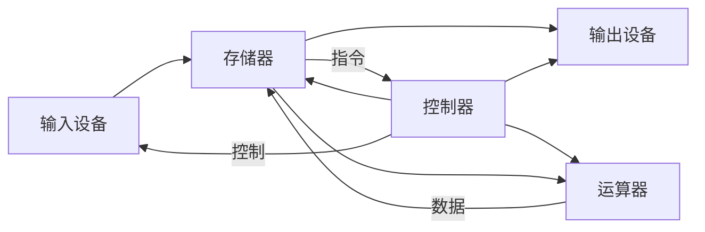
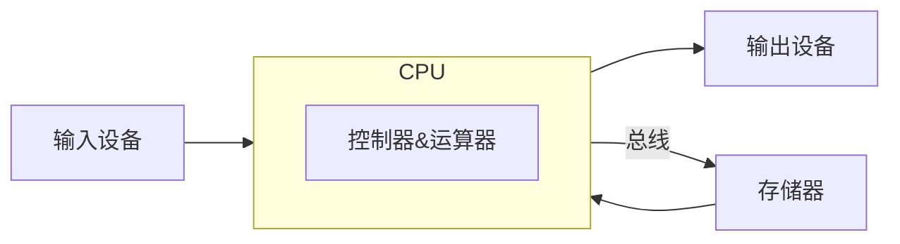

# CS-EASY-03 内存模型

## C语言内存模型

|         内存分区         |                           具体含义                           |                           应用场景                           |                           调用方式                           |
| :----------------------: | :----------------------------------------------------------: | :----------------------------------------------------------: | :----------------------------------------------------------: |
|    程序代码区 (code)     | 主要存储程序的代码编译后的机器码指令，二进制指令，同时也存储部分常量值和字符串字面值 | 代码区的内容是整个程序执行的基础，从这个区域开始调用各种函数和模块 |                         CPU执行指令                          |
|    常量区 (constant)     |      存储数字，字符串常量，以及 `const` 修饰的全局变量       | 存储在程序运行中不可修改的变量，防止**意外**的对变量的改动的发生 |           直接书写常量、字面值或通过 `const` 定义            |
| 全局数据区 (global data) | 存储**全局**变量和**静态**变量，未初始化或初始化为 $0$ 的变量存储在 BSS 段，已初始化的存储在 DATA 段 | 全局变量和静态变量的**共性**就是可以在成个程序的生命周期结束为止都可以维持状态，因此可以用于**不同函数**之间的信息沟通 |                定义全局变量以及 `static` 变量                |
|       堆区 (heap)        | 容量远大于栈区，用于存储较为**复杂**的数据类型，**动态分配**内存，并且需要**手动分配** | 当需要动态分配某些容器的使用空间时，或者在运行前无法确定数据结构所需内存大小，以及创建复杂数据结构 | 使用 `malloc() calloc() realloc() free()` 等函数进行分配内存 |
|        动态链接库        |               保存了程序可以调用的库函数等资源               | 调用在库中存储的，封装好的函数等各种资源，在程序运行时**动态加载**，并不直接将代码**链接**入可执行程序，使程序**体积更小** | 在调用现成的库时，gcc 编译**默认**使用动态库，而如果想要使用自己打包的动态库，则需要使用 gcc 命令行来完成 |
|       栈区 (stack)       | 大小**比较有限**，用于存储函数内部的局部变量、传参、返回地址等，由编译器**自动分配**，函数运行结束时**自动释放** |         处理函数调用时使用和产生的各种数据和临时变量         |  调用函数，在函数内部声明变量，函数递归过程等等都会自动分配  |


### Q1.什么是“栈溢出”？

简单来说，栈溢出是指程序在运行过程中写入给栈空间的内存量**超过**了栈的存储空间，有时甚至会导致相邻栈中的数据遭到覆写，产生严重 bug。

常见的栈溢出的情况比如函数**递归过深**，当函数递归次数过多时可能会使得栈空间消耗过多导致溢出，在算法已经最优的情况下，常见的解决方法是**记忆化**递归，用一个容器**存储**每一次递归的**返回结果**。

另一个经典的栈溢出实例是C语言的库函数 `gets()` ，使用其读取字符串时并不会对数据的长度进行判断，当数据过长时很有可能造成溢出。

除此之外，数组空间开得过大，单纯的定义过多局部变量等等情况也可能会导致栈溢出。


### Q2.堆区和栈区的区别是什么？

从根本上来说，二者的**应用场景**并不相同，栈区内存是在函数体内定义各种变量以及调用函数产生内存时会**自动调用**的部分，而堆区的内存则需**手动分配**。

更具体的一些细节如下：

1. 个人认为栈区内存具有**临时性**和**自动性**的特点

- 存放局部变量以及函数执行过程中产生的内存

- 分配时自动分配，并在函数执行结束后自动释放

而堆区则显然不具有这两个特点，应该说它具有**持久性**（？）。

2. 堆区的容量远大于栈区，因此通常存放一些更为复杂的**数据类型**。

3. 栈区按内存地址**从高到低**方向生长，堆区**从低到高**。

由于栈区的内存管理遵循**后进先出**的原则，所以很容易直接在栈顶分配内存，堆区相反的生长方向有助于更好地搜索空闲内存，且防止二者内存分配时产生**冲突**。

4. 基于上述原理，栈区内存的分配与访问速度高于堆区。


### Q3.程序运行过程中，内存模型当中的哪些区是只读的，哪些区是可读写的？

|         内存分区         |                读写情况                |
| :----------------------: | :------------------------------------: |
|    程序代码区 (code)     |                  只读                  |
|    常量区 (constant)     |                  只读                  |
| 全局数据区 (global data) |                 可读写                 |
|       堆区 (heap)        |                 可读写                 |
|        动态链接库        | 代码段只读，除此外可能含有可读写数据段 |
|       栈区 (stack)       |                 可读写                 |


### Q4.如何使用malloc()、free()函数，它们针对的哪一个区进行操作？

手动进行内存分配的 `malloc() calloc() realloc() free()` 等函数都包含在头文件 `stdlib` 中。

`malloc` 函数用于分配所需的内存，其声明如下：

```c
void *malloc(size_t size)
```

从声明中可以看出函数传入的参数为**内存的大小**，返回值为一个类型待定的**指针**。

例如，用其为一个链表节点结构体指针分配内存：

```c
#include<stdio.h>
#include<stdlib.h>
struct node{
    int val;
    struct node *next;
};
void ins_head(int x)
{
    struct node *nd=(struct node*)malloc(sizeof(struct node));

}
```

通常还会搭配使用 `sizeof` **关键字**来计算内存大小。


`free` 函数用于释放先前由 `malloc() calloc() realloc()` 等函数分配的内存，其声明如下：

```c
void free(void *ptr)
```

传入的参数是一个指针，无返回值。

以下是删除一个链表节点结构体指针的示例：

```c
void del(struct node *p)
{
    p->val=p->next->val;
    struct node *t=p->next;
    p->next=p->next->next;
    free(t);
}
```


### Q5.为什么要对程序使用的内存进行管理？

总的来说，通过C语言的内存管理，我们可以指定不同变量的作用域和生命周期，使得不同变量可以在不同模块发挥不同功能，实现对程序的**高效管控**。

栈区和堆区的配合就是一个很好的例子，栈区的自动化特性使得函数调用更为便捷，而堆区的手动分配可以实现更精确有效的控制，设计更为复杂的数据结构，同时，**动态内存**的设计也提高了内存的**使用效率**，提升了程序的性能。

除此之外，内存管理的目的也是为了保证确保内存使用的安全性，比如栈区的每个线程都有自己专属的栈，这样的管理方案确保不同线程的**隔离**，进而防止内存冲突导致的风险。

而如果没有内存的管理，就会产生**栈溢出**、**内存泄漏**等问题，这类问题的发生，正是程序产生安全问题的重要诱因之一，也正因如此，`free()` 函数才非常重要，如果不**主动释放**分配的内存，最终会导致内存耗尽。


## 内存模型的应用


```c
#include <stdio.h>
#include <stdlib.h>

const int constValue = 100;
const char* constString = "Hello, World!";
int globalVar = 10;

void function(int arg) {
    int localVar = 20;
    printf("localVar: 0x%p\n",&localVar);
    int *ptr = malloc(sizeof(int));
    *ptr = 30;
    printf("ptr: 0x%p\n",ptr);
    free(ptr);
}

int main() {
    static int staticVar = 40;
    int localVarMain = 50;
    function(60);

    printf("constValue: 0x%p\n",&constValue);
    printf("constString: 0x%p\n",constString);
    printf("globalVar: 0x%p\n",&globalVar);
    printf("staticVar: 0x%p\n",&staticVar);
    printf("localVarMain: 0x%p\n",&localVarMain);

    return 0;
}

```


尝试输出题目所提供的代码中的变量的地址，以下是其中某一次的结果：

```c
localVar: 0x000000000061FE04
ptr: 0x0000000000C41450
constValue: 0x0000000000404000
constString: 0x0000000000404004
globalVar: 0x0000000000403018
staticVar: 0x000000000040301C
localVarMain: 0x000000000061FE4C
```


从前文的分析来看，理论上来说，这些变量分别存储在如下区域：

|      变量      |  存储区域  |               原因                |
| :------------: | :--------: | :-------------------------------: |
|  `constValue`  |   常量区   |      `const` 修饰的全局变量       |
| `constString`  | 全局数据区 |     指向常量字符串的全局指针      |
|  `globalVar`   | 全局数据区 |           普通全局变量            |
|  `staticVar`   | 全局数据区 |      `static` 修饰的静态变量      |
|   `localVar`   |    栈区    | `function()` 函数中定义的局部变量 |
|     `ptr`      |    栈区    | `function()` 函数中定义的局部指针 |
| `localVarMain` |    栈区    |        主函数中的局部变量         |


这其中有几个需要注意的点：

1. `constString` 本身存储在全局数据区，但其指向的**字符串常量** `"Hello, World!"` 存储在**常量区**。

2. `ptr` 本身存储在栈区，但其指向的内存由于是通过 `malloc` 函数分配的，因此其指向的内存存储在**堆区**。
3. 有一个有意思的现象是，在每一次输出的结果中 `ptr` 所指向的内存地址**都是不同的**，这大概是因为该内存由 `malloc` 分配，而**堆区**分配内存时并非连续的地址，而是需要寻找闲置的区域，而空闲的区域在每次程序运行时可能**都不同**。


## 浅谈Cache

### Q1.什么是冯诺伊曼体系结构？什么是现代计算机的组织结构？这两者的不同点在哪里？

早期计算机的「程序」是通过纯粹的电路组合来实现的特定功能，一旦需要修改程序，就要重新改造电路本身，这意味着早期程序是**硬件**化的。而这样的设计必然导致计算机灵活性和计算效率各方面都比较落后。

而冯诺依曼提出，将程序编码为**数据**（以**二进制编码**形式），一同存储在储存器中，而程序的执行过程便是从**存储器**中取出指令并执行。

这样的设计理念实现了**软硬件分离**，摒弃了以硬件控制程序，大大提高了灵活性，最重要的是使**可编程**的计算机成为可能。


冯诺依曼体系结构主要有五大部件：**控制器、运算器、存储器、输入设备和输出设备**，大致示意图如下：



现代计算机的组织结构是在冯诺依曼体系结构的基础上改进演化而来，同时引进了一些更为复杂的软硬件结构。

相比于冯诺依曼体系结构，现代结构最核心的变化就是将控制器与运算器**集成**为**中央处理器**，即 CPU：



除此之外，现代计算机还存在另一种常见的组织结构：**哈佛结构**。

这种结构同样由冯诺依曼结构发展而来，而其最大的不同点在于**程序存储和数据存储分开**，这样做可以显著提高数据**交换速度**，但结构却过于**复杂**。

事实上，我认为现代的计算机架构并不能严格划分为这两种中的一种，因为多数现代计算机的指令和数据在**内存**中仍存储在一起，而有所区别的是在 CPU 中的**缓存**，也就是说，在 CPU 的外部使用冯诺依曼结构，而内部是哈佛结构。


### Q2.主存储器是如何工作的？

内存从根本上来说是由无数个只能存储一位数据的锁存器排列成**矩阵**，然后不断打包成更大的内存，而在矩阵结构中在某特定位置存取数据，就需要用到地址信息。

主存工作的方式就是按照**地址**存取，实现这样的功能的关键元件就是寄存器 MAR 和 MDR，其中 MAR 指的是**存储器地址寄存器**，MDR 指的是**存储器数据寄存器**，在现代计算机中，这二者制作在 CPU 芯片内。

在主存执行读取操作时，CPU 将地址传输给 MAR，再由地址总线送至主存，传入允许读取指令，再将数据读出，经由数据总线传输给 MDR，再传给 CPU。

在写入操作中，传输地址同样是第一步，之后 CPU 将写入数据传给 MDR，再传给主存，发送允许写入指令，并在指定地址单元写入数据。


### Q3.什么是Cache的局部性原理？它包括哪些方面的内容？

Cache 的局部性原理包括**时间局部性和空间局部性**。

- 时间局部性的含义是，一个反复被引用的内存在最后一次被引用之后不久很可能会被再次引用。
- 空间局部性的含义是，一个反复被引用的内存的**临近**地址的数据很可能再不久之后也会被引用。

基于这两点，CPU 会在高速缓存中存储先前访问过的内存地址，以便在不久之后再次使用，也可能同时会存储其临近的地址，比如连续存储的**数组**中其他元素的地址。


### Q4.Cache的运用为什么可以加快系统整体性能？

在计算机的存储结构中，越靠近 CPU 的存储器**速度越快**，**容量越小**，反之越远离 CPU 速度越慢，容量越大。由于高速缓存的速度远大于主存，因此 CPU 在读取数据时会优先在**高速缓存**中查找数据。

而局部性原理在缓存设计中的应用使得 CPU 访问内存的速度大大提高，预先在缓存中存储的内存可以高速访问，而无需在更大的存储器中花费巨大的时间代价搜索。

缓存的存在意义，就是在 CPU 与内存之间建立一个高效的交换通道，由于 CPU 运算速率远大于内存读写速率，缓存的存在就很好地解决了二者之间速率**不匹配**的问题，从而优化并加快了整体性能。


## 代码优化

在这里我想举一个 OI 中应该比较经典（？）的例子，那就是**矩阵乘法**的优化。

下面是一个矩阵乘法的代码示例：

```c
#include<stdio.h>

int a[1100][1100],b[1100][1100],c[1100][1100];

int main()
{
    int n,m,k;
    scanf(" %d %d %d",&n,&m,&k);
    for(int i=1;i<=n;++i)
        for(int j=1;j<=m;++j)
            scanf("%d",&a[i][j]);
    for(int i=1;i<=m;++i)
        for(int j=1;j<=k;++j)
            scanf("%d",&b[i][j]);
    for(int i=1;i<=n;++i)
        for(int j=1;j<=k;++j)
            for(int l=1;l<=m;++l)
                c[i][j]+=a[i][l]*b[l][j];
    for(int i=1;i<=n;++i)
    {
        for(int j=1;j<=k;++j)
            printf("%d ",c[i][j]);
        printf("\n");
    }
    return 0;
}

```

我们知道，在矩阵乘法的算法中，我们需要枚举**三维**进行运算，也就是说，我们算法的总复杂度是 $O(N^3)$ 。

假设我们以最常规的时限 `1.00s` 为限制，根据复杂度，数组的行或列在极限条件下是 $1000$ ，当然，在实际运行中最多 $800$ 到 $900$（开 O2 优化的条件下），我们不妨先用 $n=810$ 的**方阵**来测试一下。

_所有数据详见随机生成的测试样例 `data.out` `data2.out` 以及两个版本的程序的输出 `matrix.out` `matrix2.out` ，同时一并附上代码。_

这是乘法代码段的运行时间（未开 O2 优化）：`times: 1.241000`


优化之后的代码如下：

```c
for(int i=1;i<=n;++i)
        for(int l=1;l<=m;++l)
            for(int j=1;j<=k;++j)
                c[i][j]+=a[i][l]*b[l][j];
```


而经过小小的优化之后，运行时间如下（未开 O2 优化）：`times: 0.978000` 

优化得不多不少，开 O2 的话总程序应该能勉强跑过，在比较极限的测试数据的条件下可以多拿 10pts（？）

接下来再测试 $n=1000$ 的方阵，两份代码的时间如下：

```c
times: 2.295000
times: 1.831000
```

如果把数据拉得还要更大，就会发现数据越大，时间差异越大，优化越明显。


为什么会有优化呢？从直观上说，这个优化只是第二第三行的循环**互换了位置**而已。

问题的核心在于 b 数组，最初的版本我们先遍历 a 的行，再到 b 的列，再到 a 的列和 b 的行，此时 b 按照行来遍历，也就是枚举它的**第一维**。由于数组是通过连续的内存存储，所以按照第一维来枚举必然是**非连续的**内存访问。

改进后的版本，我们看到，最后一维进行 b 的列的遍历，也就是枚举**第二维**，只有这样才是**连续的**内存访问。

根据缓存的**局部性原理**的**空间局部性**，多次进行相邻区域内存的访问的速度，必然快于非连续性的，依照这样的方式确实达到了优化的效果，而且在更大的数据中将会表现得更为明显，这就是利用缓存的特性来进行优化的实例。

~~（这题我写得快要吐血了qwq，球球给个好评吧亲）~~

